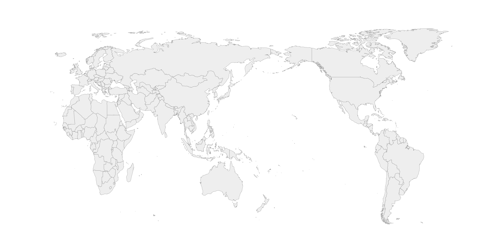

# echarts-world-map-jeojson

可供 Echarts 使用的世界地图 JeoJSON 文件，包括普通版本(worldEN.json)和中国居中版本(worldZH.json)。

其中普通版本国家名称为英文，额外提供一个国家名称中英文映射文件(country-name-map-zh.json)，可以直接用于 Echarts 的`series[map].nameMap`配置；中国居中版本国家名称为中文。

## 示例

普通版本：

中国居中版本：

